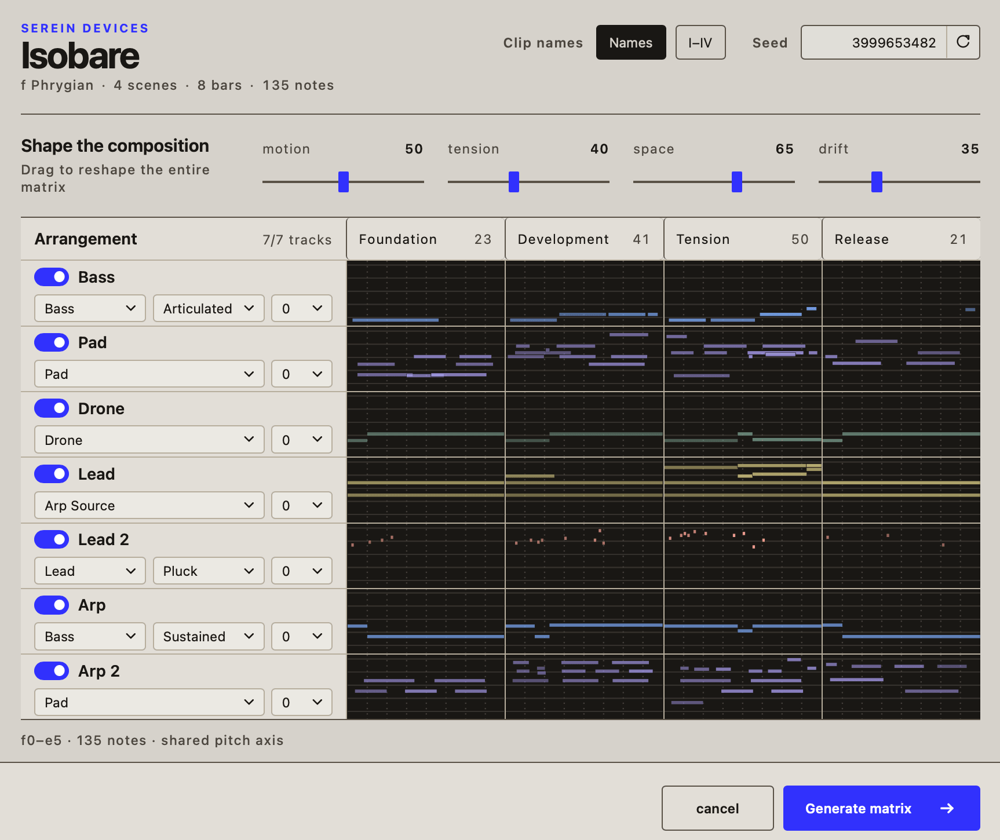

# Isobare

Isobare generates a playable matrix of related ambient MIDI scenes in Ableton
Live. You provide the tracks, instruments, and sound design; Isobare writes the
notes.

## Requirements

- Ableton Live 12 with Extensions support
- One to eight consecutive MIDI tracks
- Global Quantization set to **8 Bars** for synchronized scene changes

When using the installed `.ablx`, keep **Developer Mode off** in Live's
Extensions settings.

## Generate a matrix

1. Set Live's Global Scale. Isobare uses C major when Scale Mode is off.
2. In Session View, right-click an empty MIDI clip slot and choose
   **Generate…**. This slot becomes the upper-left corner of the matrix.
3. Include the tracks you want, then assign each a role, available style, and
   octave offset.
4. Shape the result and inspect the note preview.
5. Select **Generate matrix**.

Isobare creates four related eight-bar scenes: **Foundation**, **Development**,
**Tension**, and **Release**. The first non-MIDI track ends the destination
block. Missing scene rows are appended; existing scene names are preserved.

Occupied clips are never replaced without explicit overwrite consent. The
complete matrix is written as one Live undo step.

## Controls

| Control | Effect |
| --- | --- |
| Motion | Moves from still, sustained material toward more active phrasing |
| Tension | Moves from consonant harmony toward greater interval friction |
| Space | Opens rests, releases, and register around the material |
| Drift | Widens register and loosens repetition while preserving the composition |
| Seed | Recreates the same result when every other setting is unchanged |

The roles are **Bass**, **Pad**, **Drone**, **Arp Source**, and **Lead**. Arp
Source writes sustained chords intended for Live's Arpeggiator; the other roles
write directly playable MIDI.

Click a scene heading to view its enabled tracks on one shared pitch axis. Clip
names can use scene names or Roman numerals.

## Links

- [Download Isobare](https://serein-devices.alex-boulanger.dev/products/isobare/)
- [Changelog](CHANGELOG.md)
- [Contributing](CONTRIBUTING.md)
- [Apache License 2.0](LICENSE)

The Serein Devices and Isobare names are not licensed with the source. The
Ableton Extensions SDK is licensed separately; see [NOTICE](NOTICE).
